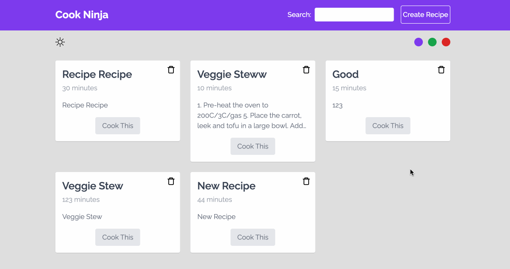

# Recipe-directory

這是來自 [Build Web Apps with React & Firebase](https://www.udemy.com/course/build-web-apps-with-react-firebase/) 課程的其中一項專案，主要是拿來練習 React 而做的簡單食譜網站

這份專案有兩個分支，分別為：

- master（自己想的版本）
- review（課程解答的版本）

網站連結：[https://jubeatt.github.io/recipe-directory](https://jubeatt.github.io/recipe-directory/)

## 網站介紹

這個網站所包含的功能如下：

- 檢視食譜列表
- 食譜的詳細頁面
- 關鍵字搜尋
- 新增食譜
- 切換背景主題（主題色 / 夜間模式）



## 使用的技術

- React
- Tailwind
- RWD
- react-router-dom
- json-server
- useContext / useEffect

## 運行方式

附註：請先確保你的電腦已經安裝 json-server，否則請先透過 `npm install -g json-server` 來安裝。

1\. 安裝專案的 dependencies

```bash
npm install
```

2\. 開啟 json-server

```bash
json-server data/db.json 
```

3\. 啟動開發環境

```bash
npm run start
```

## 打包

```bash
npm run build
```

之後再透過 live-sever 的方式打開 `/build/index.html` 即可


